# 🛍 AgenticShop: Reimagined Shopping Experience with Multi-Agent GenAI

AgenticShop is a GenAI-powered e-commerce demo that showcases how **multi-agent workflows**, powered by [LlamaIndex](https://www.llamaindex.ai/), can drive **personalized product discovery** using unstructured data like user reviews and preferences. This demo runs fully on Azure, and can be deployed quickly using the **Azure Developer CLI**.

Explore how intelligent agents handle search, sentiment, memory, and personalization with observability and memory persistence.

## 🧭 Quick Navigation

- [App Scenario](#app-scenario-personalized-e-commerce-with-genai-agents)
- [Architecture Overview](#architecture-overview)
- [Solution Accelerator Deployment](#-solution-accelerator-deployment)
- [Multi-Agent Personalization Workflow](#-multi-agent-personalization-workflow)
- [Personalized Shopping Experience Walkthrough](#-personalized-shopping-experience-walkthrough)
- [Tool-Enabled Query Routing](#-smart-query-routing-via-tool-enabled-agent)
- [Understanding What Queries Work](#-understanding-what-queries-work-and-why)


## App Scenario: Personalized E-Commerce with GenAI Agents

**AgenticShop** is a GenAI-powered e-commerce demo that showcases how multi-agent systems and in-database intelligence can deliver personalized shopping experiences.

Built on **LlamaIndex**, the app leverages:

- **`pg_diskann`** for fast vector search over product data
- **`azure_ai`** for in-database sentiment and feature extraction
- **Apache AGE** to model product–review–feature relationships as a graph
- **Phoenix (Arize AI)** for observability and agent tracing

The frontend also features an **Agentic Flow UI**, providing real-time visibility into how agent workflows are triggered and executed—helping users understand what's happening under the hood.

### 🎯 Primary Use Cases

1. **Product Personalization**
   A multi-agent workflow built using `LlamaIndex`'s `Workflow` module powers personalized product discovery by analyzing user preferences and reviews in real time.

2. **Agentic Query Routing**
   A smart search box routes user queries to the appropriate tool—vector search, sentiment-aware querying, or personalized agent workflows—based on inferred intent.

Using a curated electronics dataset (products, reviews, user profiles), AgenticShop enables:

- 🔎 **Semantic product search** with vector embeddings
- 🧠 **Sentiment-aware querying** using review insights
- 👤 **Profile-driven personalization** via persistent memory (Mem0)
- 🧭 **Agentic query routing** through a smart unified search box

The result is a responsive and intelligent user experience where AI agents dynamically interpret and fulfill user queries—whether it’s finding the right product, analyzing reviews, or adjusting user preferences.

## Architecture Overview

The following image shows the high-level architecture of the solution, highlighting how various Azure services and components work together to power the agentic shopping experience.

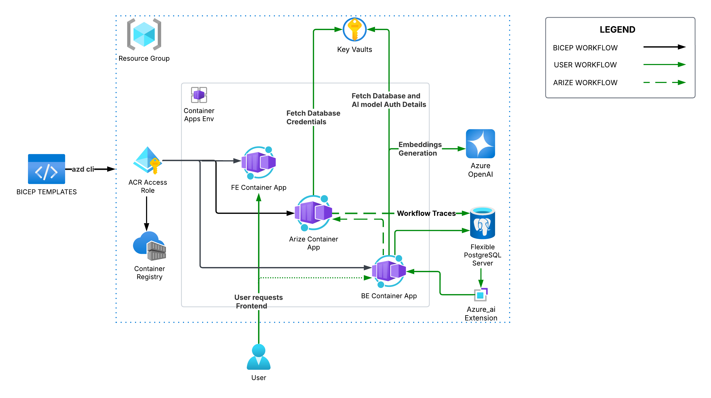

### 🧩 Key Components

- **Frontend**:
  - React (SPA) hosted on **Azure Container Apps**
  - Includes a live **Agentic Flow UI** for workflow transparency

- **Backend**:
  - **FastAPI** for API and orchestration logic
  - **Azure OpenAI (GPT-4o and text-embedding-3-small)** for agent reasoning
  - **Azure Key Vault** for secrets management
  - **Apache AGE Extension** for graph-based queries
  - **pg_diskann Extension** for fast vector search
  - **azure_ai Extension** for in-database NLP

- **Observability**:
  - **Phoenix by Arize** for tracing and debugging LLM-based workflows

### 🏗️ Infrastructure Summary

The solution is deployed entirely within a single **Azure Resource Group** and uses the following core infrastructure:
- **Azure Container Apps Environment**
- **Azure OpenAI**
- **Azure Flexible PostgreSQL Server**
- **Azure Key Vault**
- **Bicep Templates**

## 🚀 Solution Accelerator Deployment

### 🧰 Prerequisites
The following are prerequisites for deploying this solution:
1. [Azure Developer CLI](https://learn.microsoft.com/en-us/azure/developer/azure-developer-cli/install-azd?tabs=winget-windows%2Cbrew-mac%2Cscript-linux&pivots=os-linux)
2. [Azure CLI](https://learn.microsoft.com/en-us/cli/azure/install-azure-cli)
3. [Azure CLI extension](https://learn.microsoft.com/en-us/cli/azure/azure-cli-extensions-overview) `rdbms-connect`
4. An Azure account with an active subscription.
5. [Powershell Core](https://learn.microsoft.com/en-us/powershell/scripting/install/installing-powershell?view=powershell-7.5)
6. Appropriate roles attached to user for solution deployment (`Contributor` role and `Role Based Admin Control Administrator` role for the subscription)
7. [Git](https://git-scm.com/)

### 🛠️ Deployment Steps

#### Clone the Repository
Clone the repository. Once done, navigate to the repository:
```sh
git clone https://github.com/Azure-Samples/postgres-agentic-shop.git
cd postgres-agentic-shop
```

#### Log in to your Azure account
To log in to Azure CLI, use the following command. You can use the `--use-device-code` flag if the command fails.
```sh
az login
```
To log in to Azure Developer CLI, use this command. You can use the `--use-device-code` flag if the command fails.
```sh
azd auth login
```

#### Create a new Azure Developer environment
In the root of the project, execute the following command to create a new `azd` environment. Provide a name for your `azd` environment:
```sh
azd env new
```

#### Grant permissions to azd hook scripts
If you are deploying the solution from **Windows**, run the following command to grant permissions to the current session to execute `pwsh` scripts located in the `azd-hooks` directory:
```sh
Set-ExecutionPolicy -Scope Process -ExecutionPolicy Bypass
```

If you are deploying the solution from **Unix-like environment on Windows OS** (for instance Cygwin, MinGW), grant the following permissions for execution of scripts in the `azd-hooks` directory:
```sh
pwsh -NoProfile -Command "Set-ExecutionPolicy -Scope CurrentUser -ExecutionPolicy Bypass"
```

#### Solution Deployment
**NOTE** that this solution uses postgres authentication for creating connection to database. It is recommended to change the `ADMINISTRATOR_LOGIN_USER` and `ADMINISTRATOR_LOGIN_PASSWORD` parameters in `main.parameters.json` file in `infra` directory before deployment as best security practice.

1. Run the following command to provision the resources.
```sh
azd up
```
Once the above command is executed, the `azd` workflow prompts user to select the subscription for deployment, two locations (one for the solution accelerator resources and another for Azure OpenAI models), and the resource group to create.

2. Make sure that you have enough Azure OpenAI model quota in the region of deployment. **The `azd` workflow automatically filters and shows the region where the Azure OpenAI quota is available.** The Azure OpenAI quota required for `GlobalStandard` **deployment type** for this solution is listed below. This configuration can be changed from the `main.parameters.json` file in the `infra` directory using the following parameters:
    - **`GlobalStandard` GPT-4o:** 50K TPM - `AZURE_OPENAI_CHAT_DEPLOYMENT_CAPACITY`
    - **`GlobalStandard` text-embedding-3-small:** 70K TPM - `AZURE_OPENAI_EMBED_DEPLOYMENT_CAPACITY`
If you have changed the above parameters from the `main.parameters.json` file, you **must change** the following configuration in `main.bicep` file so that the changes are reflected in automatic Azure OpenAI region filtering as well:
```sh
@metadata({
  azd: {
    type: 'location'
    usageName : [
      'OpenAI.GlobalStandard.gpt-4o, 50'
      'OpenAI.GlobalStandard.text-embedding-3-small, 70'
    ]
  }
})
param openAILocation string
```

3. Before the `azd` workflow proceeds, checks are performed in the selected infra region and recommendations are generated on failure for following cases to ensure that the deployment is successful.
    - Azure Flexible Server for PostgreSQL SKU
    - Azure Container Apps quota
    - azd env name

4. After creating the resource group, the workflow prompts the user for the Azure Container Apps deployment. Input `yes` as shown below. The deployment might take some time and will provide progress updates in the terminal as well as on the Azure Portal.
```sh
Do you want to deploy Azure Container Apps? (y/n): yes
```

The deployment might take several minutes. Progress updates will be displayed in the terminal and can also be tracked via the Azure Portal.

Once the deployment is complete, `azd` will output the **application URLs** for the deployed services.

> **Note:** Make sure to **copy the frontend URL** displayed in the output and open it in your browser to access the application.

### 🧹 Tear Down
To destroy all the resources that have been created in the steps above, as well as remove any accounts deployed by the solution accelerator, use the following command:
```sh
azd down --purge
```
The `--purge` flag deletes all the accounts permanently.

### 🛟 Troubleshooting
1. The troubleshooting guide for `azd cli` is [here](https://learn.microsoft.com/en-us/azure/developer/azure-developer-cli/troubleshoot?tabs=Browser).
2. A validation error occurs when unsupported characters, such as `_`, `#` etc. are used while initializing or creating a new environment or resources. Refer to [rules and restrictions](https://learn.microsoft.com/en-us/azure/azure-resource-manager/management/resource-name-rules) for naming conventions.
3. A scope error occurs when the user does not have appropriate permissions when deploying resources through `azd` workflow. Attach `Contributor` role and `Role Based Access Control Administrator` role to user permissions before deploying the solution accelerator.
4. When `The resource entity provisioning state is not terminal. Please wait for the provisioning state to become terminal and then retry the request` error occurs, restart the deployment using the `azd up` command.

### 📝 Additional Notes

- Ensure all services are running and accessible at their respective ports.
- If you encounter issues, check the logs for each service and verify your environment variables.
- For troubleshooting Azure deployments, refer to the [Azure Developer CLI troubleshooting guide](https://learn.microsoft.com/en-us/azure/developer/azure-developer-cli/troubleshoot).
- Make sure Docker has sufficient resources allocated for smooth operation.

## 🤖 Multi-Agent Personalization Workflow

AgenticShop uses a modular, event-driven multi-agent system built on **LlamaIndex Workflows** to personalize the shopping experience. Each agent has a clearly defined role, and they collaborate through structured events to fulfill complex user intents.

### 🧠 Key Agents

- **Planning Agent**: Decides which agents to invoke based on user input and memory
- **Product Personalization Agent**: Generates tailored product descriptions using user preferences
- **Inventory Agent**: Checks product availability and variants
- **Review Agent**: Generates personalizations related to product reviews
- **Evaluation Agent (Optional)**: Ensures review agent responses do not expose internal database identifiers or backend details to end users.
- **Presentation Agent**: Synthesizes all agent outputs into a cohesive response

These agents are orchestrated via LlamaIndex’s `Workflow` module, providing traceability, modularity, and fallback behavior in case of timeouts.

### 🧬 Personalization & Memory

The system uses **mem0** to persist user preferences across sessions. This memory influences agent behavior in real time:
- Past interactions are retrieved at workflow start
- New preferences (e.g., “I care about portability”) are stored dynamically
- All memory is stored in the `mem0_chatstore` table in PostgreSQL

> Agent prompts can be modified in [`backend/src/agents/prompts.py`](backend/src/agents/prompts.py) to customize tone, structure, or output logic.

### 🧭 Visualizing the Agent Workflow

Below is the LlamaIndex workflow generated via its visualization tool:
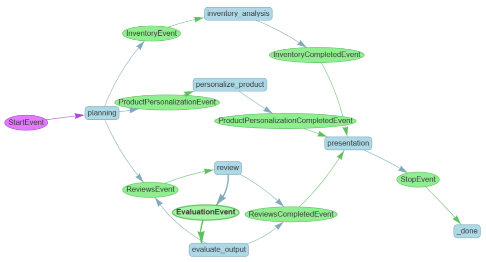

Each step function in the workflow is connected by **events**, enabling modular and reactive execution.

#### ⚙️ How It Works

- **Steps**: Each node in the workflow wraps a specific function—such as an agent, tool, or logic function. Steps listen for incoming events and respond accordingly.
- **Events**: Structured messages that carry context and trigger steps. Each step defines input and output event types, making the flow dynamic and extensible.
- **Execution Flow**: The workflow starts with `workflow.run(input_event)`, and proceeds by chaining steps through emitted events. This allows the system to reactively evolve based on user input and intermediate results.

This event-driven architecture ensures agents are loosely coupled, traceable, and easy to modify or extend.

## 🛍 Personalized Shopping Experience Walkthrough

Experience how AgenticShop delivers tailored product suggestions through multi-agent intelligence:

- Start the frontend (the URL was output earlier as part of `azd up` command) and choose a pre-set user profile. Each profile has a different set of profile pre-configured

  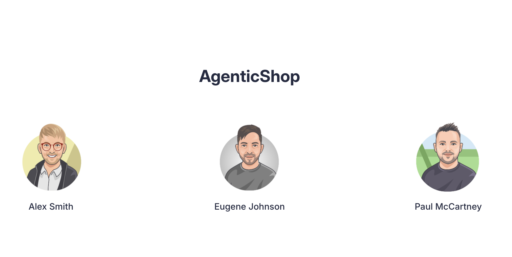

- Perform a search (e.g., “Wireless headphones”) → products are retrieved via semantic search and personalized against profile preferences.

- Select any product and view the personalized content on a product detail page. Note that the personalization shows information that is relevant for this user.

  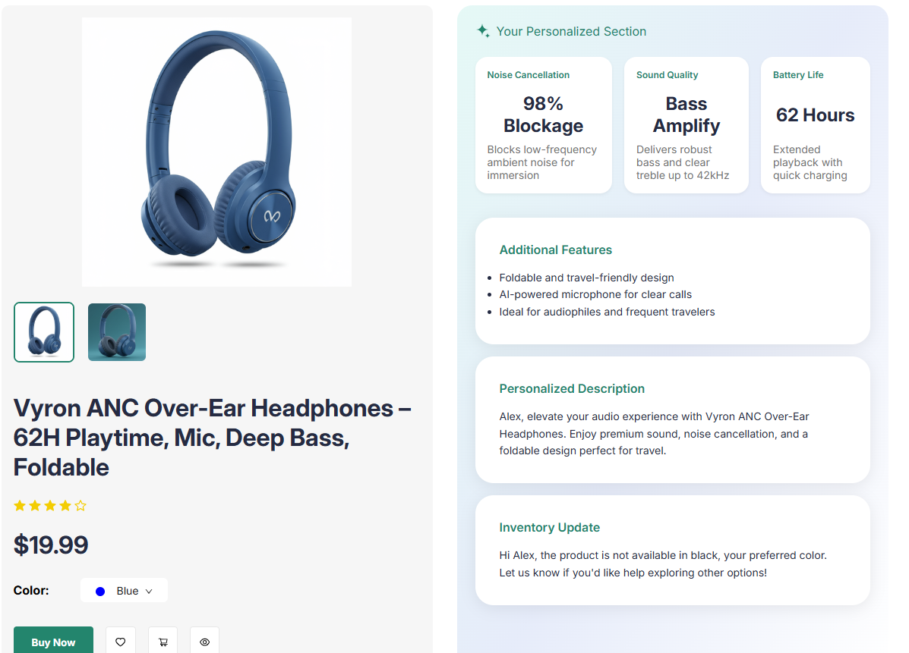


- On the top right is the **Agentic Flow** drawer which provides an under-the-hood look at the multi-agent flow. Open the **Agentic Flow** panel to inspect how each agent participates in this multi-agent flow. Note that all agents are not always triggered. For example, in this case the review agent is not triggered.

  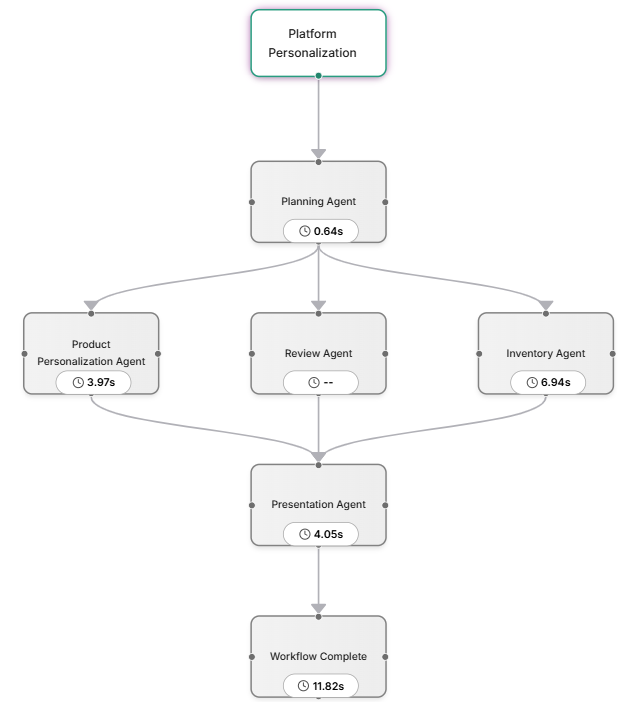


- Now lets try a command to update our personalization. In the command bar input new preferences (e.g., "Show critical reviews about durability").

  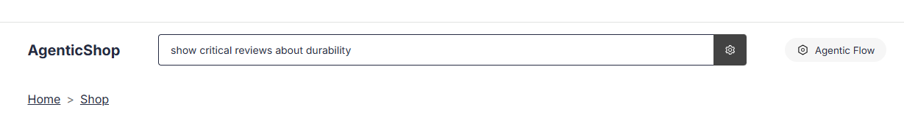


- This will re-trigger the personalization workflow and update the product page with this new information.

  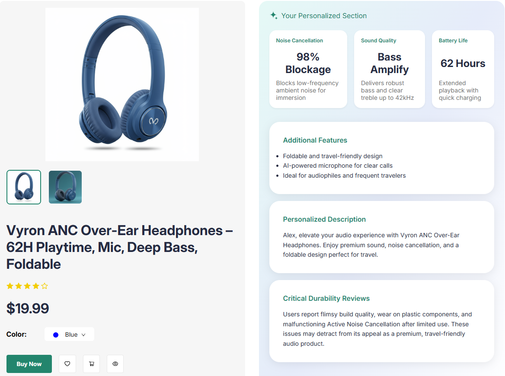


- Open the **Agentic Flow** panel to see confirm that the **Review Agent** has now been triggered.

  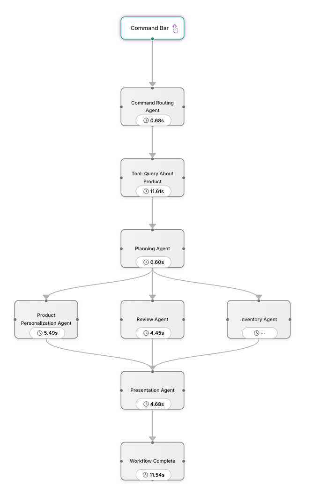


- To see persistent personalization in action, try entering a preference like:
  **"Always show me critical reviews about durability."**
  In case the memory is updated a "Memory updated" message is shown. This new information be stored in memory using **mem0**.

  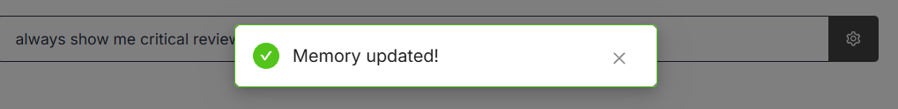


- Now, open a different product whose personalization hasn’t been generated yet. You should see a new section highlighting **critical reviews about durability** as part of the personalized output.

  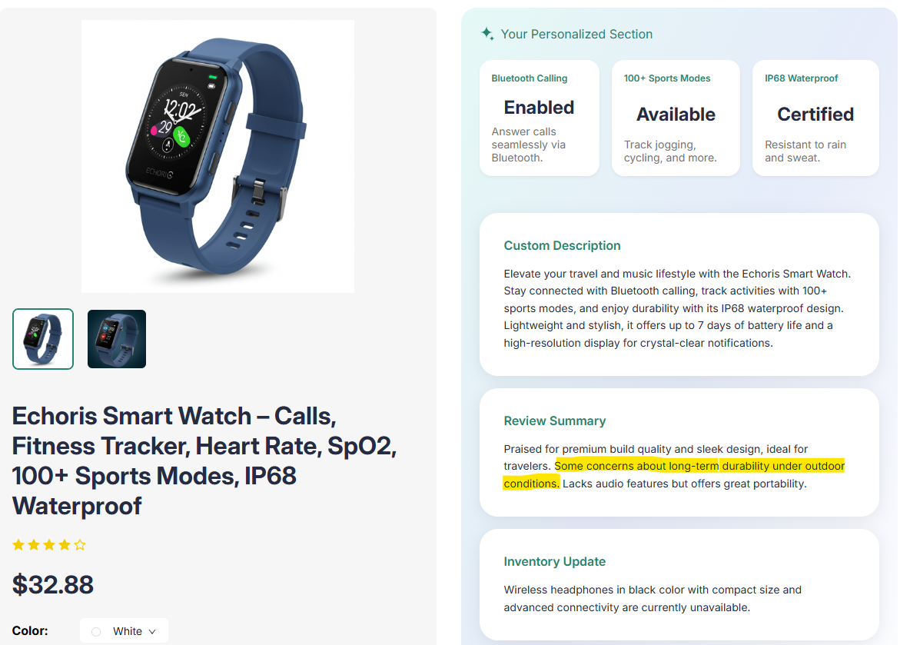


  > ⚠️ Note: Personalizations are cached for performance. If a product’s personalization was generated *before* the new memory was saved, it may not reflect the updated preference. Personalization workflow typically takes **~10 seconds** to complete.

This walkthrough showcases how AgenticShop delivers a responsive, transparent, and memory-driven shopping experience.

## 🧠 Smart Query Routing via Tool-Enabled Agent

AgenticShop includes a powerful **Command Routing Agent** that interprets user queries and dynamically routes them to the appropriate tool—enabling a seamless, natural-language search experience.

This agent is equipped with **three tools**, each designed to handle a distinct type of user query:

| Tool | Purpose |
|------|---------|
| `query_about_product` | Triggers the multi-agent personalization workflow for a selected product |
| `search_products` | Performs vector search using pg_diskann |
| `query_reviews_with_sentiment` | Combines sentiment + feature filters to rank products based on review insights |

### 🔎 Try These Queries

- **General Search**
  Query: `"Waterproof headphones"`
  → The Command Routing Agent selects the `search_products` tool and performs a semantic vector search.

- **Sentiment-Based Query**
  Query: `"Wireless headphones with good noise cancellation"`
  → The agent uses the `query_reviews_with_sentiment` tool to return products with strong sentiment around the feature.

- **Personalization Trigger**
  Query (on a product detail page): `"Always show if red color is available in stock"`
  → The agent invokes the `query_about_product` tool, launching the multi-agent personalization workflow.


### 🛰️ Inspect Tool Execution

- Open the **Agentic Flow** panel to see how the system:
  - Parsed the query
  - Chose the correct tool
  - Executed it and streamed the results back
- This provides full transparency into how natural language queries are mapped to structured backend logic.

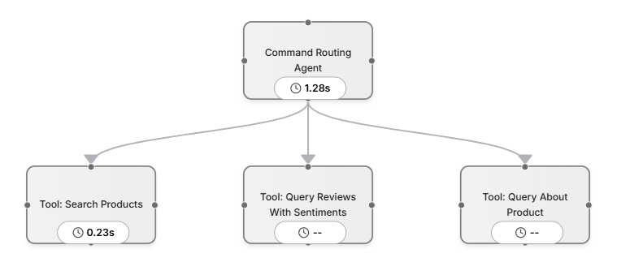


> ⚠️ If a sentiment-based query fails to map to a known feature or lacks reviews, the system gracefully falls back to a general vector search and displays a notice.

## 🔍 Understanding What Queries Work (and Why)

AgenticShop supports intelligent query handling over a **limited dataset**. To get meaningful results, it’s important to understand what product categories and features are supported, and how the system interprets your queries.

### ✅ Supported Product Categories

The system currently supports **three categories only**:

- 🧠 Smartwatches
- 🎧 Headphones
- 📱 Tablets

> ❌ Queries outside these categories (e.g., "laptops", "TVs", "keyboards") will return no results.

You can view all supported features per category in [`backend/data/features.csv`](backend/data/features.csv).

---

### 🧠 Query Types and Tools

AgenticShop supports two core query types via distinct tools:

#### 1. 🧭 Standard Vector Search

Used for **general product discovery**, e.g.:

- "Wireless earbuds"
- "Smartwatch with fitness tracker"

This is powered by **pg_diskann**, which performs a vector search over product descriptions and specs.

💡 Internally, the system tries to **infer the product category** from the query. If the model fails to map it to one of the 3 supported categories, **no results will be returned**.

---

#### 2. 💬 Sentiment-Aware Search

Used for **feature-based product discovery with sentiment context**, e.g.:

- "Headphones with great noise cancellation"
- "Tablets with reliable cellular connectivity"

This combines:

- Vector search
- In-database sentiment + feature extraction using **Azure AI**
- Graph filtering using **Apache AGE**

The system attempts to map:

- The product category
- The mentioned feature (e.g., "noise cancellation")

If either mapping fails, the query will not yield accurate results.

---

### ❌ Why Some Queries May Fail

Query: `"Smartwatch with great battery life"`

This might not work because:

- **Battery life** may not be one of the **predefined features** in the dataset
- It may be mentioned in reviews but not linked to a tracked feature
- It may not be mentioned with **positive sentiment**
- Reviews may not mention it at all

---

### 🔁 Flexible Matching

The system supports **synonyms and close variations** of features:

All of these map to the tracked feature **Noise Cancellation**:

- "Headphones with great active noise cancellation"
- "Headphones with great ANC"
- "Headphones with great noise cancellation"

---

### 📌 Review Coverage Matters

Even if a feature is supported, the system needs relevant **review content** to extract sentiment.

If no reviews discuss a feature for a product, it won’t affect the ranking—even if the feature exists in product specs.

---

## 🧪 Sample Queries That Work

Use the examples below to test how different tools behave:

### 🧍 Product-Specific Query Handling
_(Used when you're on a product page)_

- "Show critical reviews about durability"
- "Always show a summary of critical reviews"
- "What do users dislike about this smartwatch"
- "Is this product available in black"
- "Always highlight the product’s availability in red"

### 🧭 Standard Vector Search
_(General product discovery with semantic matching)_

- "Wireless headphones"
- "Waterproof smartwatches"
- "Tablets with HD display"
- "Headphones for workout"
- "Smartwatches with step tracking"

### 💬 Sentiment-Aware Search
_(Feature-based preference queries)_

- "Headphones with great noise cancellation"
- "Smartwatches with accurate heart rate monitoring"
- "Top tablets with strong parental controls"
- "Smartwatches with reliable sleep tracking"
- "Headphones with average ANC"

---

> 💡 If a feature is supported but missing in user reviews, results may fall back to standard search with a notification.
